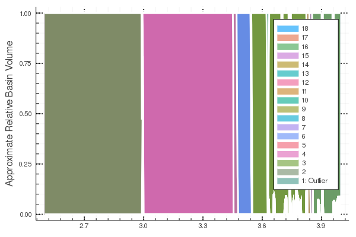

# Basic Usage

In the following we will show how the library works on two example, a logistic map and a first order Kuramoto network.

First, we import the library and all other packages that we need to set up the systems.

```julia
using MCBB
using LightGraphs
using Clustering
using DifferentialEquations
using Distributions
using StatsBase
using PyPlot
```

## Logistic Map

The logistic map ``x_{n+1} = r x_{n}(1 - x_{n})`` is one of the most well known and studied chaotic systems. Even though this library is tailored towards higher dimensional and multistable system, we can study the logistic map with it as a first example as well.

First, we set up how the parameter, ``r`` and the initial conditions should be varied. The function generating the ICs and parameters need have either `()->new_value::Number` or `(i_run)->new_value::Number` signature.
```julia
rdist = Uniform(2.5,4);
icdist = Uniform(0.1,0.99);
r = ()->rand(rdist);
ic_ranges = ()->rand(icdist);
```
There are also other ways to setup the initial conditions. You can define a function that returns an array for all system dimensions for multidimensional systems or provide arrays with the values directly. See [`DEMCBBProblem`](@ref) for more infos.  
Then, we set up how many initial conditons / parameter points we want to generate and solve
```julia
N_ic = 5000;
```
The parameters of our systems are supposed to be structs whose supertype is `DEParameters`, e.g. `struct my_par <: DEParameters end`. In this case, the logistic map and its parameters are already pre-made in the library:
```julia
pars = logistic_parameters(r(1));
par_var = (:r,r);
```
The tuple `par_var` contains the name of the parameter field to be changed as a symbol and the function how it should be changed. This tuple will be automatically converted to a [`ParameterVar`](@ref) which also could have been constructed directly. This can be needed for more complicated setups.

Next, we set up the base DifferentialEquations problem (if you are interested in problems that can't be solved with DifferentialEquations, see [`CustomMCBBProblem`](@ref)). As mentioned, the logistic map is already one of the pre-made systems, thus
```julia
dp = DiscreteProblem(logistic, [ic_ranges()], (0.,5000.), pars);
```
We are only interested in solutions after 80% of the integration time
```julia
tail_frac = 0.8;
```
and can use the pre-made `eval_ode_run` for analyzing the solutions of each Differential Equation (see [`eval_ode_run`](@ref) for more information). This `eval_ode_run` will track the mean, std and Kullback-Leibler divergence of the solutions. Thus we can finally setup the [`DEMCBBProblem`](@ref) with
```julia
mc_prob = DEMCBBProblem(dp, ic_ranges, N_ic, pars, (:r,r), eval_ode_run, tail_frac);
```
and solve it
```julia
log_sol = solve(log_emcp);
```
Subsequently, we calculate the distance matrix and cluster the results
```julia
D_log = distance_matrix(log_sol, mc_prob, [1,0.75,0.5,1.]);

```
In order to determine the ``\epsilon`` parameter of DBSCAN we suggest one of three possibilities:
* k-dist graph to the 4-th Neareast neighbour: [`k_dist`](@ref)
* cumulative KNN distance: [`KNN_dist`](@ref) and [`KNN_dist_relative`](@ref)
* response analysis by continuation of the integration (more complicated and computationally intensive): [`eval_ode_run`](@ref)

For many systems we tried, we found that all three methods yield similar results. In this case we take the median of the ``0.5\\%`` of all members nearest neighbour (in this case 25-NN).

```julia
median(KNN_dist_relative(D))
> 0.06565762359625632
```

```julia
db_eps = 0.65
db_res = dbscan(D,db_eps,4)
cluster_members = cluster_membership(log_emcp,db_res,0.005,0.001);
plot(cluster_members[1],cluster_members[2],legend=false)
```


For more details, see [`DEMCBBProblem`](@ref) and the other references linked in this section.

## Kuramoto Network

Next, we will investage the onset of synchronization in system of first order Kuramoto oscillators on an Erdos-Renyi random network. We set up the initial conditions and parameters similar to the first example:

```julia
N = 20
K = 0.5
nd = Normal(0.5, 0.2)
w_i_par = rand(nd,N) # eigenfrequencies

net = erdos_renyi(N, 0.25)
A = adjacency_matrix(net)

ic = zeros(N)
ic_dist = Uniform(-pi,pi)
kdist = Uniform(0,5)
ic_ranges = ()->rand(ic_dist)
N_ics = 3000
K_range = (i)->rand(kdist)
pars = kuramoto_network_parameters(K, w_i_par, N, A)

rp = ODEProblem(kuramoto_network, ic, (0.,3000.), pars)
```
In this case we want to have another evaluation function. We don't need the Kullback-Leibler divergence, but we are interested in the global order parameter as the system to compare it to our results.

```julia
function k_order_parameter(u::AbstractArray)
    uend = u[:,end]
    N = length(uend)
    1. /N*sqrt((sum(sin.(uend)))^2+(sum(cos.(uend)))^2)
end

function eval_ode_run_kura(sol, i)
    N_dim = length(sol.prob.u0)
    state_filter = collect(1:N_dim)
    eval_funcs = [mean, std]
    global_eval_funcs = [k_order_parameter]
    eval_ode_run(sol, i, state_filter, eval_funcs, global_eval_funcs, cyclic_setback=true)
end
```
We set up the `DEMCBBProblem` again with
```julia
tail_frac = 0.9  
ko_mcp = DEMCBBProblem(rp, ic_ranges, N_ics, pars, (:K, K_range), eval_ode_run_kura, tail_frac)
kosol = solve(ko_mcp)
```
and solve and analyze it. In this case we set the weight of the order parameter to zero as we only want to have it as a comparison for our results.

```julia
D_k = distance_matrix(kosol, ko_mcp, [1.,0.75,0,1.]); # no weight on the order_parameter and kl div
db_eps = 110 # we found that value by scanning manually
db_res = dbscan(D_k,db_eps,4)
cluster_members = cluster_membership(ko_mcp,db_res,0.2,0.05);
ax = subplot(111)
lp = plot(cluster_members[1],cluster_members[2])
legend(lp, ("Noise Cluster","Cluster 1", "Cluster2"))
ax[:spines]["top"][:set_visible](false)
ax[:spines]["right"][:set_visible](false);
```


In this plot we see the onset of synchronization clearly as three distinctive clusters.
We can compare this to the order parameter that we calculated:
```julia
plot(parameter(ko_mcp),get_measure(kosol,4))
xlabel("Coupling K")
ylabel("Order Parameter R");
```


As we see the cluster membership diagram really shows the onset of the synchronization.

## Solution Object

The solution object stores all the measures and some other information. [`Introspective Features`](@ref) in this manual goes into some more detail about it, but it is important to note that every of the measures are ordered in the following way:
    * first: all per dimension measures in the same order as in the `eval_funcs` array (default: 1: mean, 2: SD, 3: KL-Div)
    * then: all global measures
    * optional: for routines that also incorporate the parameters, they are last in order.
This order plays a role for all routines that work with one of the measures.

## Distance Matrix/Metric

The distance matrix calculation is one of these cases. When we assign the weights in the call to distance matrix, we have to adhere to this ordering. For the example above `[1.,0.75,0.,1.]` thus means: weight 1. on mean, 0.75 on SD, 0. on KL-Div and 1. on the parameter.
The clustering is based on the distance matrix. Its calculation is performed with ['distance_matrix'](@ref). Naturally they are many ways how to define a distance matrix between the solutions. They are two main different variants in the library so far

* Directly compute the difference between the individual values of the measures with a suitable norm. This is the default option (with an L1-norm used)
* For each measure first compute a histogram or empirical CDF for each run and compare these with each other. For this purpose the keyword `histograms=true` needs to be set. This is recommended when investigating systems with many (more or less) identical subparts such as oscillator networks and the specific position/number of a single oscillator is not important. The default measure to compare the histograms is the 1-Wasserstein distance.

## Clustering

So far, we used mainly DBSCAN for the clustering. In principal, one can also use other clustering algorithms though. DBSCAN also returns a "Noise Cluster"/Outlier. In the standard julia implemenation this is Cluster "0", here for all routines the Outliers are Cluster "1" and all other clusters have the following ascending numbers. 

## How-to define your own systems.

### System Functions

The system function follow the notation of DifferentialEquations.jl and should thus have arguments `(du,u,p,t)` that are changed inplace. For example a Roessler system can be definded with:  

```julia
function roessler!(dx,x,p::roessler_pars,t)
  dx[1] = - x[2] - x[3]
  dx[2] = x[1] + p.a*x[2]
  dx[3] = p.b + (x[1] - p.c)*x[3]
end
```
For more information also see the documentation of DifferentialEquations.jl. In case one wants to work with systems that can't be solved with DifferentialEquations.jl, one has to use [`CustomMCBBProblem`](@ref).

### Parameters

All parameters have to have [`DEParameters`](@ref) as a supertype to work. Thus, for the Roessler example
```julia
struct roessler_pars <: DEParameters
  a::Number
  b::Number
  c::Number
end
```
works as the parameter type. See [`DEParameters`](@ref) and subsequent doc strings for a list of all pre-made functions and parameters.

## Tips & Tricks

The method relies on random sampling, if you want to share scripts or notebooks and reliably get the same results, you should use a constant seed for the RNG with
```julia
using Random
Random.seed!(23124);
```
This is primarily needed because the ordering of the clusters can change for every run through the script.

In the next section, we will show how these results can be further analyzed.
