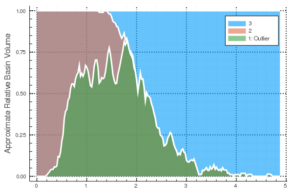
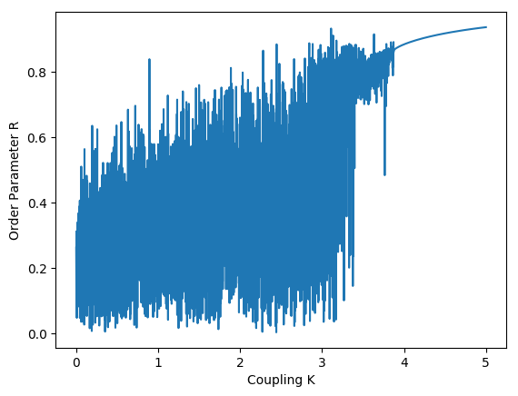
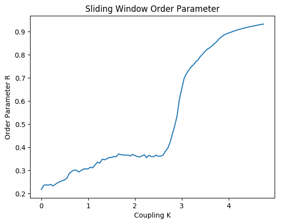
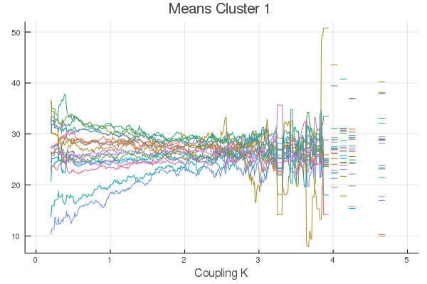
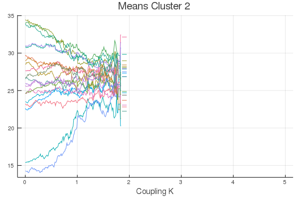
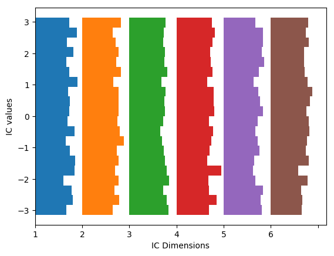

# Introspective Features

This page showcases introspective features of the libary.

The example are First Order Kuramoto Oscillators with ``\mathcal{N}(0.5,0.2)`` distributed eigenfrequencies on a Erdos Renyi random network. Subsequently the coupling is increased as the free parameter. The basic setup is identical to the previous section.

```julia
using MCBB
using LightGraphs
using Clustering
using DifferentialEquations
using Distributions
using StatsBase
using PyPlot
```

```julia
N = 20
K = 0.5
nd = Normal(0.5, 0.2)
w_i_par = rand(nd,N)

net = erdos_renyi(N, 0.25)
A = adjacency_matrix(net)

ic = zeros(N)
ic_dist = Uniform(-pi,pi)
kdist = Uniform(0,5)
ic_ranges = ()->rand(ic_dist)
N_ics = 6000
K_range = (i)->rand(kdist)
pars = kuramoto_network_parameters(K, w_i_par, N, A)

# base problem
rp = ODEProblem(kuramoto_network, ic, (0.,3000.), pars)

# we also calculate the order parameter, we won't use it for clustering, but we'll use it as a check
function k_order_parameter(u::AbstractArray)
    uend = u[:,end]
    N = length(uend)
    1. /N*sqrt((sum(sin.(uend)))^2+(sum(cos.(uend)))^2)
end

function eval_ode_run_kura(sol, i)
    N_dim = length(sol.prob.u0)
    state_filter = collect(1:N_dim)
    eval_funcs = [empirical_1D_KL_divergence_hist]
    global_eval_funcs = [k_order_parameter]
    eval_ode_run(sol, i, state_filter, eval_funcs, global_eval_funcs, cyclic_setback=true)
end

tail_frac = 0.9 #
ko_mcp = DEMCBBProblem(rp, ic_ranges, N_ics, pars, (:K, K_range), eval_ode_run_kura, tail_frac)
kosol = solve(ko_mcp)
```
The results are sorted by parameter value, [`show_results`](@ref) shows only results within the given parameter range.

[`normalize(sol:DEMCBBSol)`](@ref) normalized the results so that all measures are within the range $[0,1]$.

```julia
D_k = distance_matrix(kosol, ko_mcp, [1.,0.75,0.,0,1.]); # no weight on the order_parameter and kl div
db_eps = 110 # we found that value by scanning manually
db_res = dbscan(D_k,db_eps,4)
cluster_members = cluster_membership(ko_mcp,db_res,0.2,0.05);
ax = subplot(111)
plot(cluster_members[1],cluster_members[2])
ax[:spines]["top"][:set_visible](false)
ax[:spines]["right"][:set_visible](false);
```



* plot one of the measures dependend on the parameter with [`get_measure`](@ref) gets the $k$-th measure. In this case the order is [mean, std, kl-div, order parameter]
* get the parameter array with `parameter(prob::BifMCProblem)`
* here we plot the Order Parameter

```julia
plot(parameter(ko_mcp),get_measure(kosol,4))
xlabel("Coupling K")
ylabel("Order Parameter R");
```


Or do this with a sliding window:
```julia
p_wins, R_grid = measure_on_parameter_sliding_window(ko_mcp, kosol, 4, 0.2, 0.05);
plot(p_wins,R_grid[1,1,:])
xlabel("Coupling K")
ylabel("Order Parameter R");
title("Slding Window Order Parameter")
```


Of course we can also get the multidimensional measures

```julia
plot(parameter(ko_mcp),get_measure(kosol,1))
xlabel("Coupling K")
ylabel("Mean");
```


In this plot we already see the onset of the synchronization.

We can restrict this analysis to single clusters as well.

The method [`cluster_measures`](@ref) gets the measure for each cluster seperately and applies a sliding window. The routine returns the parameter values of the sliding window, a ``N_{cluster}\times N_{measures}\times N_{dim}\times N_{windows}`` array for measures that are evalauted for every dimension and a ``N_{cluster}\times N_{measures}\times N_{windows}`` for global measures. For windiws in which the cluster has no members a `NaN` is returned. This is (in constrast to `missing` or `nothing`) compatible with most plotting routines. We should however always define common x-Limits for the plots because of this.

```julia
(p_win, cluster_measures_dim, cluster_measures_global) = cluster_measures(ko_mcp, kosol, db_res, 0.1, 0.01);
```

```julia
xlim_values = [0, 5]
plot(p_win,Array(cluster_measures_dim[1,1,:,:]'))
title("Means Cluster 1")
xlabel("Coupling K");
xlim(xlim_values[1], xlim_values[2])
```




```julia
plot(p_win,Array(cluster_measures_dim[2,1,:,:]'))
title("Means Cluster 2")
xlabel("Coupling K");
xlim(xlim_values[1], xlim_values[2])
```



```julia
plot(p_win,Array(cluster_measures_dim[3,1,:,:]'))
title("Means Cluster 3")
xlabel("Coupling K");
xlim(xlim_values[1], xlim_values[2])
```


The method [`cluster_means`](@ref) returns the mean value of each measure for each cluster.

```julia
cluster_ms = cluster_means(kosol, db_res);
print("Means of the 3rd cluster: ")
print(cluster_ms[3,1,:])
```
    Means of the 3rd cluster: [29.4609, 29.4524, 29.4574, 29.4589, 29.4585, 29.4609, 29.4593, 29.4607, 31.5164, 29.4558, 27.5155, 29.4559, 29.4578, 29.4578, 29.4576, 29.4582, 31.7665, 29.4609, 29.4653, 29.595]


[`ClusterICSpaces`](@ref) enables us to analyse which initial conditions lead to the different clusters.
The ``struct`` is constructed with [`ClusterICSpaces`](@ref). Additional parameter bounds can be provided to rescrict the analysis to the specified parameter range. It returns the [`ClusterICSpaces`](@ref)-struct with the fields:
* `data::AbstractArray`: N_cluster long Array of N_dim+1 (+1 for the parameter) Arrays with the ICs/Parameter, e.g. `data[2][1]` for the ICs of IC-dimension 1 that lead to results classified in cluster 2
* `histograms::AbstractArray`: N_cluster long array of of N_dim+1 histograms for each IC/Par dimension and Cluster
* `means::AbstractArray`: means of data
* `stds::AbstractArray`: stds of data

Statistics of the ICs across their dimension. For each run the mean, stds, skew of the ICs used for this run is calculated, These are the distributions of theses statistics for all runs. For example certain clusters/behaviour must be favoured if the ICs are already very close together, thus possessing a small ``std``
* `cross_dim_means::AbstractArray`
* `cross_dim_stds::AbstractArray`
* `cross_dim_skews::AbstractArray`

```julia
cics = ClusterICSpaces(ko_mcp, kosol, db_res; min_par=1, max_par=4);
```

```julia
plt[:hist](cics.cross_dim_stds[1], density=true, alpha=0.5, label="Cluster1")
plt[:hist](cics.cross_dim_stds[2], density=true, alpha=0.5, label="Cluster2")
plt[:hist](cics.cross_dim_stds[3], density=true, alpha=0.5, label="Cluster3")
xlabel("Standard Deviation of all ICs in a run")
ylabel("rel. Magnitude")
legend();
```


This shows the Stds of the ICs for each Cluster.

Next we plot the distributions of each IC dimension for each Cluster.

```julia
ICPlot = 1:6 # which IC dimensions to plot
cics_in = cics
i_cluster = 1 # which cluster to plot

hists = cics_in.histograms[i_cluster]
nbins = length(hists[1].weights)
n_dim = length(ICPlot)
weights = zeros((n_dim,nbins))
edges = zeros((n_dim,nbins+1))
for i=1:n_dim
    weights[i,:] = hists[ICPlot[i]].weights
    edges[i,:] = hists[ICPlot[i]].edges[1]
end

weight_maxima = maximum(weights;dims=2)
hist_range = [minimum(edges),maximum(edges)]
max_weight_maxima = maximum(weight_maxima)
x_locs = 0:(max_weight_maxima+0.05*max_weight_maxima):(sum(weight_maxima)+max_weight_maxima)

centers = (edges[:,1:end-1] .+ edges[:,2:end]) ./ 2
heights = diff(edges, dims=2)

fig, ax = subplots()


for i_hist=1:n_dim
    ax[:barh](centers[i_hist,:], weights[i_hist,:], height=heights[i_hist,:], left=x_locs[i_hist])
end

xlabel("IC Dimensions")
ylabel("IC values")

ax[:set_xticks](x_locs)
ax[:set_xticklabels]([string(i) for i in ICPlot]);
```

